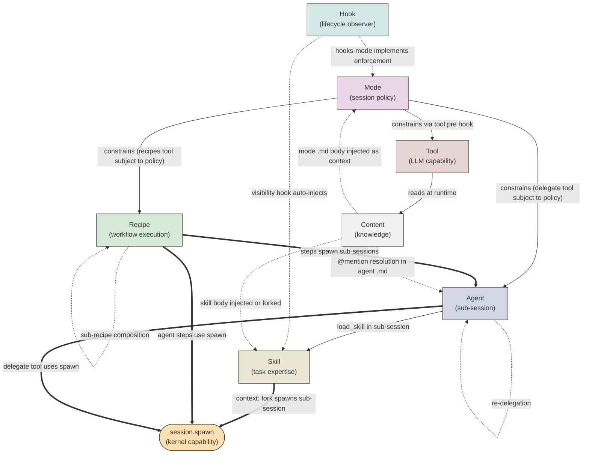
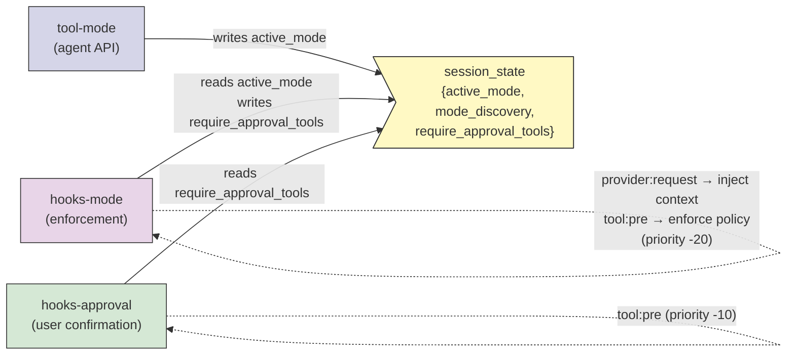
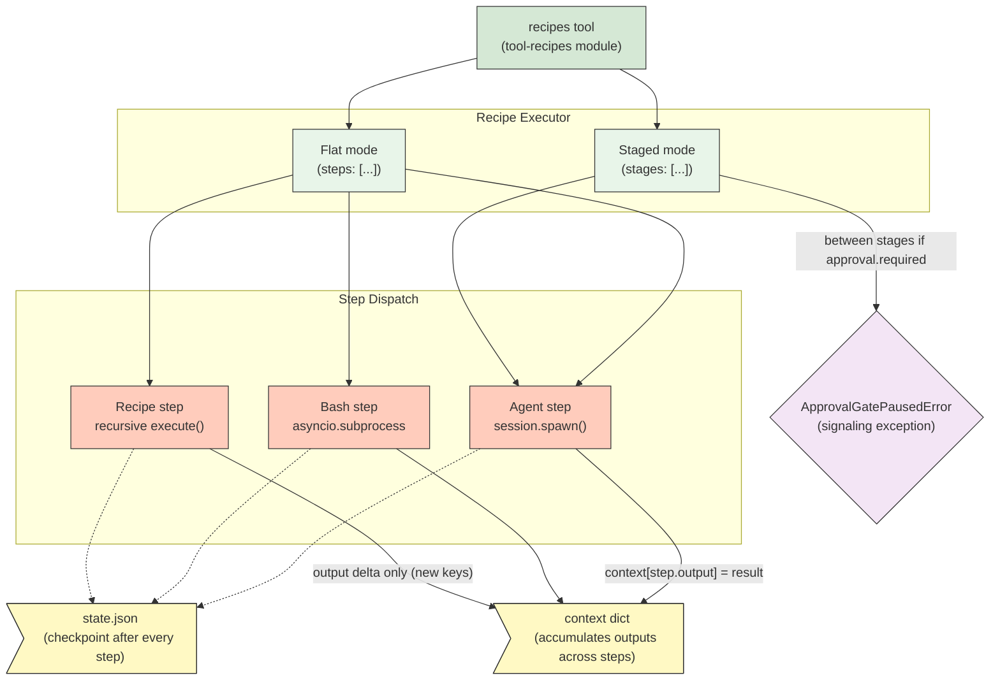
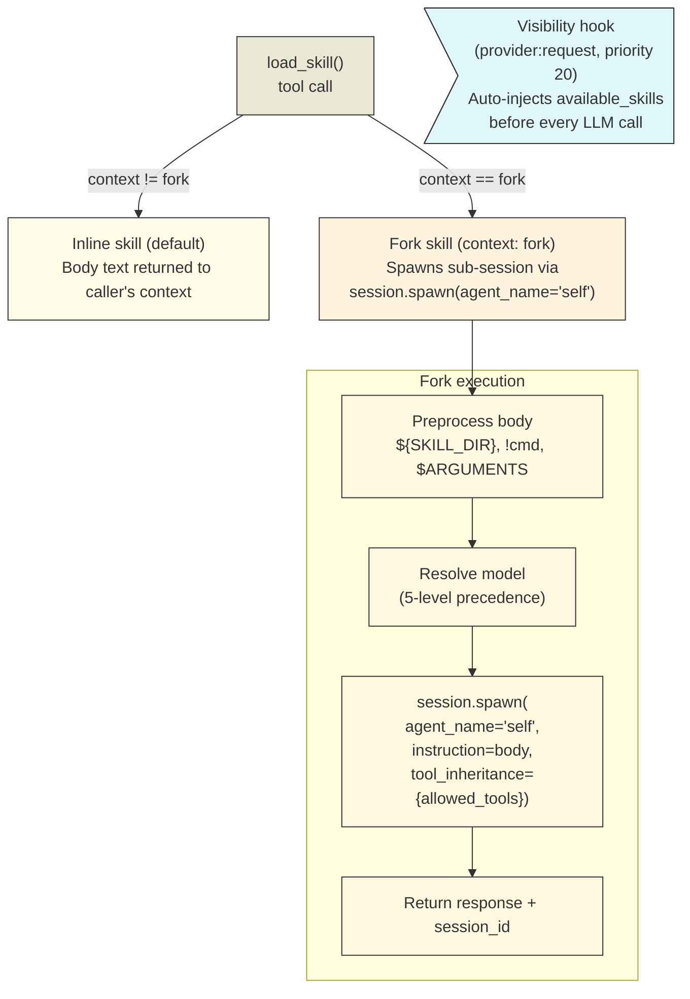
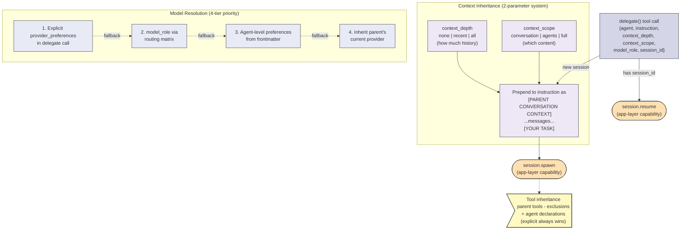

# Bundle Developer's Guide to Amplifier Mechanisms

## Introduction

Amplifier exposes seven composable primitives for building agent systems: **modes**, **recipes**, **skills**, **agents**, **hooks**, **tools**, and **content**. They overlap by design. The goal is not to pick one, but to assign **clear ownership** and **correct attachment points**, then compose them through **behaviors** — the YAML wiring layer that assembles mechanisms into bundles.

> **Use combinations freely. Avoid duplicated authority.**

---

## Mechanism Composition Graph

The mechanisms do not form a strict hierarchy. They compose laterally, and several share the same kernel substrate (`session.spawn`).



**Key insight:** Three mechanisms — recipes, agents, and fork-skills — all converge on the same kernel capability (`session.spawn`). Understanding this shared substrate explains why they overlap and where they diverge.

---

## Core Mechanisms

### Modes (Session Policy)

Session-wide overlays that constrain tool usage and inject behavioral guidance.

**What they do:**
- Gate tool calls via four policy levels: `safe`, `warn`, `confirm`, `block`
- Inject the mode's markdown body as an ephemeral system-reminder on every LLM turn
- Control transitions between modes and whether clearing is allowed

**How they actually work:**

The mode system is a two-module, hook-driven architecture communicating through `session_state`:



- `hooks-mode` registers two hooks: `provider:request` (injects mode guidance as ephemeral context) and `tool:pre` (enforces tool policy). Priority -20 ensures it fires before the approval hook at -10.
- `tool-mode` exposes `mode(set/clear/list/current)` to the LLM. A `gate_policy` (default: `warn`) controls how freely agents can switch modes.
- The approval hook has zero mode knowledge — it reads a generic `require_approval_tools` set from `session_state`. This is the complete decoupling interface.
- Mode state is **ephemeral** — stored only in `session_state`, re-injected fresh each turn. Modes are togglable, not set-once-and-forget.

**Bundle author decisions:**
- Tool policy tiers (`safe`/`warn`/`confirm`/`block`) per tool
- `default_action`: what happens to unlisted tools (`block` or `allow`)
- `allowed_transitions`: which modes can be switched to (lock-down capability)
- `allow_clear`: whether `/mode off` is permitted
- Infrastructure tools (`mode`, `todo`) always bypass restrictions

**Mode file format** (`.md` with YAML frontmatter):
```yaml
---
mode:
  name: my-mode
  description: Short description for listing
  shortcut: my-mode
  tools:
    safe: [read_file, glob, grep, delegate, recipes, todo]
    warn: [bash]
    confirm: [write_file, edit_file]
  default_action: block
  allowed_transitions: [review, plan]
  allow_clear: true
---

Markdown body — injected as system context when active.
Supports @namespace:path mentions (resolved at injection time).
```

**Discovery order** (first match wins): explicit config paths, project `.amplifier/modes/`, user `~/.amplifier/modes/`, bundle's own `modes/`, composed bundles' `modes/` directories.

---

### Recipes (Workflow Execution)

Declarative YAML workflows with sequential/staged execution, state persistence, and approval gates.

**What they do:**
- Define multi-step agent workflows with checkpointing and resumability
- Dispatch steps as sub-sessions, bash commands, or nested recipes
- Support foreach/while loops with parallel execution
- Provide approval gates for human-in-loop checkpoints (staged recipes only)

**How they actually work:**

The recipe executor (`executor.py`, ~2800 lines) is an async Python engine sitting behind the `recipes` tool:



- **Two execution modes**: flat (linear `steps:` list) and staged (`stages:` with approval gates between them).
- **Three step types**: `agent` (spawns sub-session via `session.spawn`), `bash` (direct subprocess), `recipe` (recursive execution with context isolation).
- **State persistence**: After every step, the executor checkpoints to `state.json` — step index, context dict (values > 100KB trimmed), completed steps. Resumption reloads from disk and continues.
- **Approval gates** use `ApprovalGatePausedError` — a signaling exception that pauses the recipe. The tool returns `status: "paused_for_approval"` to the caller. On approval, `resume` restarts from the checkpoint with `_approval_message` injected into context.
- **Foreach loops**: Iterate over a context variable. `parallel: true` uses `asyncio.gather` with isolated context copies per iteration. `parallel: N` bounds concurrency via `asyncio.Semaphore(N)`.
- **Sub-recipe composition**: Child recipe gets only explicitly mapped context keys (`step_context`). Returns an "output delta" — only the keys the sub-recipe added, not its intermediate variables. Recursion tracked via `RecursionState` (default: max depth 5, max total steps 100).
- **Variable substitution**: `{{variable}}` syntax with dot-notation traversal (e.g., `{{analysis.severity}}`).

**Bundle author decisions:**
- Flat vs. staged (do you need approval gates between phases?)
- Which steps are agent steps vs. bash vs. sub-recipes
- Parallel concurrency limits for foreach loops
- What context flows between steps (explicit `output:` keys)
- Retry policy per step (`max_attempts`, `backoff`)
- Recursion limits for nested recipes

---

### Skills (Task Expertise)

Reusable knowledge packages that are either injected as text or forked as sub-sessions.

**What they do:**
- Provide heuristics, rubrics, templates, and scripts on demand
- Support three progressive disclosure levels: metadata (auto-visible), content (on load), references (companion files)
- Fork skills spawn full sub-sessions for complex task execution

**How they actually work:**

Skills have two fundamentally different execution modes:



- **Inline skills** return body text to the caller's context. No sub-session, no tool restriction — the skill's content becomes guidance for the current agent.
- **Fork skills** (`context: fork`) spawn a full sub-session via `session.spawn(agent_name="self")`. The skill body becomes the sub-agent's instruction. `allowed_tools` restricts the forked session's tool surface. This is architecturally equivalent to lightweight agent delegation.
- **Visibility hook** (`provider:request`, priority 20) auto-injects an `<available_skills>` list before every LLM call as an ephemeral user message. Skills with `disable-model-invocation: true` appear in a separate "user-invoked" section — the model sees them but is instructed to wait for explicit user invocation (e.g., slash commands).
- **Preprocessing pipeline** (fork skills only, trusted sources): `${SKILL_DIR}` expansion, `!`cmd`` shell execution (sandboxed: limited env vars, 30s timeout, 1MB output), `$ARGUMENTS` substitution. Remote git sources have shell commands blocked.
- **Discovery** (first match wins): explicit config sources, `$AMPLIFIER_SKILLS_DIR`, workspace `.amplifier/skills/`, user `~/.amplifier/skills/`. Git URL sources are shallow-cloned to `~/.amplifier/cache/skills/`.

**Bundle author decisions:**
- Inline vs. fork (does the skill need isolation, its own tool surface, or parallel sub-agents?)
- `disable-model-invocation`: should the model proactively load this, or wait for user?
- `allowed-tools`: tool surface restriction for fork skills
- `model_role`: what kind of model should run the fork?
- Whether to use the full curated skills (`skills.yaml` behavior) or just the tool (`skills-tool.yaml` behavior) with your own skills

**Fork skills blur the skill/agent boundary.** A fork skill like `code-review` spawns 3 parallel review agents. `mass-change` decomposes work into 5-30 parallel units. These are workflow orchestration, not passive know-how. Use fork skills when you want agent-like behavior with simpler distribution (drop a directory, no bundle infrastructure).

---

### Agents (Sub-Sessions via Delegation)

Sub-sessions spawned for subproblems, with isolated context and optional session resumption.

**What they do:**
- Spawn isolated sub-sessions with their own tools, system prompt, and model configuration
- Support context inheritance (how much parent history to share)
- Support session resumption (multi-turn engagement with accumulated context)
- Act as **context sinks** — absorb token cost of exploration and return only summaries

**How they actually work:**

The delegate tool (`tool-delegate`, ~1250 lines) is a thin orchestration shim that validates inputs, builds inherited context, and calls into app-layer capabilities:



- **The delegate tool does not spawn sessions itself.** It calls `session.spawn` / `session.resume` capabilities registered by the app layer. This is the kernel's "mechanism not policy" principle.
- **Context inheritance** is a 2-parameter system producing 9 combinations: `context_depth` (none/recent/all) controls how much history; `context_scope` (conversation/agents/full) controls which content types. The inherited context is prepended to the instruction text as a formatted block.
- **Tool inheritance**: Spawned agents get parent's tools minus configured exclusions, but the agent's own explicit tool declarations always win. Default: `exclude_tools: [tool-delegate]` — sub-agents cannot re-delegate unless their frontmatter explicitly declares `tool-delegate`.
- **Self-delegation** (`agent="self"`) spawns the parent's own bundle as a sub-session with depth tracking (max 3 by default). Named agents reset the depth chain to 0.
- **Session resumption**: The delegate tool returns a `session_id`. Passing it back resumes the existing sub-session with accumulated context. Agents are not necessarily ephemeral.
- **Session ID format**: W3C Trace Context — `{parent-span}-{child-span}_{agent-name}`, enabling hierarchical traceability.

**Agent file format** (`.md` with YAML frontmatter):
```yaml
---
meta:
  name: my-agent
  description: "Appears in delegate tool schema — the LLM reads this to choose agents"
model_role: [reasoning, general]     # ordered preference for routing matrix
provider_preferences:                # agent-level default model selection
  - provider: anthropic
    model: claude-opus-*             # glob pattern, resolved at runtime
tools:                               # agent-specific tool declarations
  - module: tool-filesystem
  - module: tool-search
---

# Agent body — becomes the sub-session's system prompt.
# @mentions below are resolved by the app layer when building the sub-session.

@foundation:context/some-context.md
```

**Bundle author decisions:**
- What `model_role` the agent needs (reasoning, coding, fast, critique, etc.)
- Which tools the agent should have (explicit declarations override exclusions)
- How much parent context sub-agents should inherit
- Whether agents need resumability (multi-turn vs. one-shot)

---

### Hooks (Lifecycle Observers)

Code-decided functions that fire on session lifecycle events.

**What they do:**
- Observe and optionally modify behavior at lifecycle points
- Inject context, gate tool calls, log events, transform requests
- Fire deterministically (not LLM-decided) — the code controls when they run

**How they actually work:**

Hooks register on named events with numeric priorities. Lower priority fires first.

| Event | When | Common Uses |
|-------|------|-------------|
| `provider:request` | Before every LLM call | Mode guidance injection, skills visibility, status context |
| `tool:pre` | Before every tool invocation | Mode enforcement (-20), approval (-10) |
| `tool:post` | After tool completes | Logging, Python check hook |
| `session:start` | Session begins | Session naming, logging setup |
| `session:end` | Session completes | Cleanup |

**Priority ordering matters.** Mode enforcement at -20 populates `require_approval_tools` before the approval hook at -10 reads it. This is how decoupled modules communicate: one writes to `session_state`, the other reads from it.

**The hook contract:**
- `mount(coordinator, config)` — register hooks and return metadata
- Hooks return `HookResult` with an action: `continue` (pass through), `inject_context` (add to LLM request), or `deny` (block the operation with a message)
- `ephemeral=True` on context injection means it's re-injected fresh each turn, not stored in conversation history

**Bundle author decisions:**
- Which lifecycle events to hook
- Priority relative to other hooks (check what's already registered)
- Whether to use `session_state` for inter-hook communication
- Whether injected context should be ephemeral or persistent

**Tools vs. Hooks — the triggering difference:**

| | Tools | Hooks |
|---|---|---|
| **Triggered by** | LLM decides to call | Code (lifecycle events) |
| **Control** | LLM-driven (model chooses when/if) | Deterministic (fires every time) |
| **Use when** | The LLM needs to take action | You need guaranteed behavior |

---

### Tools (LLM Capabilities)

External access surfaces that the LLM can invoke.

**What they do:**
- Provide the LLM with capabilities: file operations, web access, search, shell execution
- Expose a schema that the LLM reads to decide when and how to call them
- Can be composed per-agent (each agent can have a different tool surface)

**How they actually work:**
- Tools are kernel modules with `mount(coordinator, config)` that register via `coordinator.mount("tools", tool)`.
- The tool's `description` property is read by the LLM to decide invocation. Dynamic descriptions (like the delegate tool's agent list) update per session.
- Tool policies from modes are enforced by the `tool:pre` hook — the tool itself is unaware of mode restrictions.

**Bundle author decisions:**
- Which tools to include in your behavior YAML
- Tool configuration (e.g., `tool-skills` with custom `skills_dirs`)
- Tool inheritance: what tools sub-agents should/shouldn't inherit

---

### Content (Knowledge)

Passive information injected into context at various levels.

**What they do:**
- Provide docs, policies, specs, templates, and examples
- Injected via `@mention` resolution at bundle load time, mode activation, or agent spawning

**How they actually work:**
- `@namespace:path` references are resolved by the `mention_resolver` capability
- In mode `.md` files: mentions in the body are resolved when the mode is activated. Unresolvable mentions are removed (not left as raw text).
- In agent `.md` files: mentions at the bottom are resolved by the app layer when building the sub-session's system prompt.
- In bundle/behavior definitions: `context: include:` lists inject files into the root session.

**Bundle author decisions:**
- What context to inject into the root session vs. into specific agents (token budget)
- The **context sink pattern**: heavy docs go into agent `.md` files (loaded in their context), thin pointers go into root session context (saves tokens)

---

## Attachment Points

> **Where does it bind, and how long does it live?**

| Mechanism | Attaches to | Lifetime | State location | Authored as |
|-----------|-------------|----------|----------------|-------------|
| Mode | Session | Togglable, ephemeral re-injection | `session_state["active_mode"]` | `.md` with YAML frontmatter |
| Recipe | Workflow execution | Per-invocation, resumable | `state.json` on disk | `.yaml` |
| Agent | Sub-session | One-shot or resumable | Kernel session (in-memory) | `.md` with YAML frontmatter |
| Skill | Task pattern | On-demand (inline or forked) | None (stateless) or fork session | `SKILL.md` in a directory |
| Hook | Lifecycle event | Session lifetime | Module state + `session_state` | Python module |
| Tool | LLM decision | Session lifetime | Module state | Python module |
| Content | Context window | Per-injection | None (consumed by LLM) | `.md` files |

---

## The Wiring Layer: Behaviors

Behaviors are YAML files that compose mechanisms into reusable capability packages. They are how mechanisms become available in a session.

```yaml
# Example: behaviors/my-feature.yaml
includes:
  - bundle: some-dependency:behaviors/base
hooks:
  - module: hooks-mode
    source: git+https://github.com/microsoft/amplifier-bundle-modes@main#subdirectory=modules/hooks-mode
    config:
      search_paths: ["@my-bundle:modes"]
tools:
  - module: tool-mode
    source: git+https://github.com/microsoft/amplifier-bundle-modes@main#subdirectory=modules/tool-mode
    config:
      gate_policy: warn
  - module: tool-skills
    config:
      skills:
        - "@my-bundle:skills"
agents:
  include:
    - my-bundle:agents/specialist
context:
  include:
    - my-bundle:context/instructions.md
```

**Key pattern:** A behavior wires hooks, tools, agents, and context into a single composable unit. Bundles compose behaviors via `includes:`. This is the layer between individual mechanisms and the final bundle.

---

## What Each Mechanism Should Own

| Concern | Primary owner | Why not elsewhere |
|---------|---------------|-------------------|
| Session-wide constraints | **Mode** | Hooks enforce deterministically; skills/recipes can't guarantee session-wide policy |
| Multi-step workflow ordering | **Recipe** | Checkpointing and approval gates require persistent state |
| Task-specific expertise | **Skill** | Portable, discoverable, loadable on demand without sub-session overhead |
| Complex sub-task reasoning | **Agent** | Needs isolated context, own tool surface, potentially different model |
| Guaranteed lifecycle behavior | **Hook** | Fires deterministically, not subject to LLM judgment |
| LLM-decided capabilities | **Tool** | Model chooses when to invoke based on schema |
| Reference knowledge | **Content** | Passive — no execution, just context |

> **Authority Rule:** one concern, one source of truth.

---

## Choosing the Right Mechanism

Ask in order:

1. Must it always apply, regardless of what the LLM decides? **Hook** (code-decided enforcement) or **Mode** (policy overlay)
2. Is it a multi-step process with checkpoints? **Recipe**
3. Is it reusable task knowledge, loadable on demand? **Skill**
4. Does it need external system access? **Tool**
5. Does it need isolated reasoning with its own context? **Agent**
6. Is it just reference information? **Content**

**Distinguishing hooks from modes:** Hooks are Python modules — use them when you need programmatic logic (parse responses, compute values, call APIs on lifecycle events). Modes are declarative `.md` files — use them when you need tool policy tiers and injected guidance without writing code.

**Distinguishing skills from agents:** Inline skills are cheaper (no sub-session overhead) and portable (Agent Skills spec). Fork skills converge with agents but require less infrastructure (a directory vs. a bundle). Use agents when you need: resumable sessions, specific tool composition, or deep context isolation.

---

## Failure Modes (Misplaced Attachment)

| Anti-pattern | Symptom | Fix |
|---|---|---|
| **Policy leakage** (too low) | Safety rules in skills or recipe prompts — inconsistent enforcement | Move to a **mode** with tool policy tiers |
| **Workflow hidden in skills** | Step sequences encoded in skill bodies — brittle, no checkpointing | Move to a **recipe** |
| **Expertise smearing** (too high) | Heuristics duplicated across recipe step prompts | Centralize in a **skill** |
| **Skill hypertrophy** | A skill that spawns agents, manages state, enforces policy | Split: policy to mode, workflow to recipe, expertise stays in skill |
| **Capability fiction** | APIs described in context but not exposed as tools | Wire as a **tool** (or MCP resource) |
| **Cognitive overload** | Single agent prompt does everything | Decompose into **delegated agents** with focused concerns |
| **Knowledge entanglement** | Docs copy-pasted into agent prompts, skills, and recipe steps | Centralize as **content** files, reference via `@mention` |
| **Missing hook, using mode** | You need programmatic logic (compute, API calls) but used a mode | Write a **hook** module — modes are declarative only |

---

## Practical Example: This Bundle

The `system-design-intelligence` bundle composes all seven mechanisms:

| Mechanism | Instance | Role |
|-----------|----------|------|
| **Modes** | `system-design`, `design-review` | Enforce read-only tool policy during design; block file writes until design is complete |
| **Recipes** | `architecture-review` (staged, 2 approval gates), `design-exploration` (parallel foreach), `codebase-understanding` (sequential) | Structure multi-step design workflows with checkpointing |
| **Agents** | `systems-architect` (reasoning), `design-critic` (critique), `design-writer` (writing) | Isolated sub-sessions with different model roles and focused concerns |
| **Skills** | `adversarial-review` (fork, 5 parallel agents), `tradeoff-analysis`, `architecture-primitives`, `system-type-web-service`, `system-type-event-driven` | Task expertise loaded on demand — the fork skill spawns its own review agents |
| **Hooks** | `hooks-mode` (from modes bundle) | Mode enforcement and context injection |
| **Tools** | `tool-mode`, `tool-skills` (via behavior YAML wiring) | LLM-accessible mode switching and skill loading |
| **Content** | `system-design-principles.md`, `structured-design-template.md`, `instructions.md` | Design philosophy, templates, and standing orders injected into root session |

All wired together through `behaviors/system-design.yaml`, which composes the modes behavior, configures the skills tool with local skill directories, declares the three agents, and includes the context files.

---

## Mental Model

| Mechanism | Verb | Triggered by |
|-----------|------|-------------|
| **Mode** | constrains | User or agent activates |
| **Recipe** | organizes | User or agent invokes |
| **Agent** | thinks | Parent delegates |
| **Skill** | knows how | Agent loads on demand |
| **Hook** | observes | Lifecycle event (deterministic) |
| **Tool** | acts | LLM decides to call |
| **Content** | informs | Resolution at load/injection time |

---

## Closing

When mechanism choice gets confusing, ask:

> **"Where should this attach, and who triggers it?"**

- Attach at the **highest level where it remains valid** — session-wide constraints go in modes, not skills.
- **Code-decided behavior** (must happen every time) goes in hooks. **LLM-decided behavior** (model judges when) goes in tools.
- **Recipes own ordering**, skills own expertise, agents own reasoning. Don't smear one into another.

That question — attachment point plus trigger — resolves almost everything.
